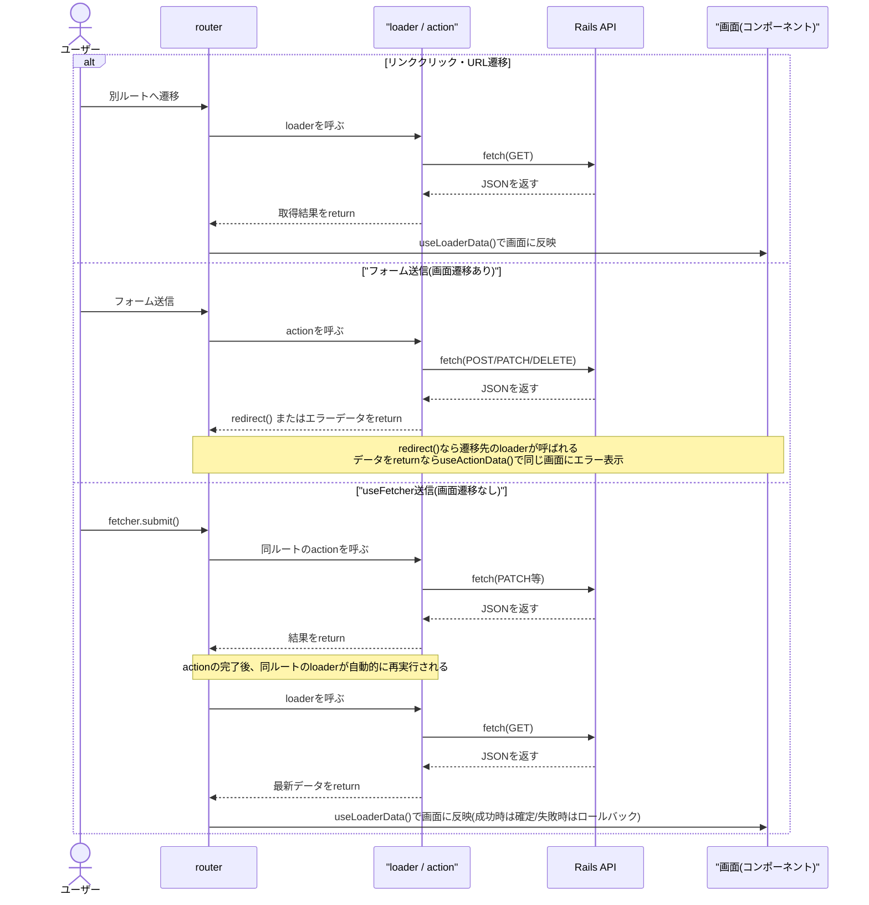
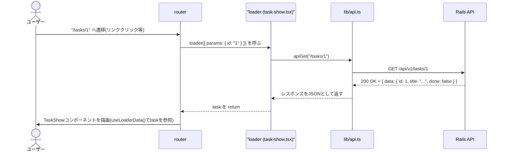
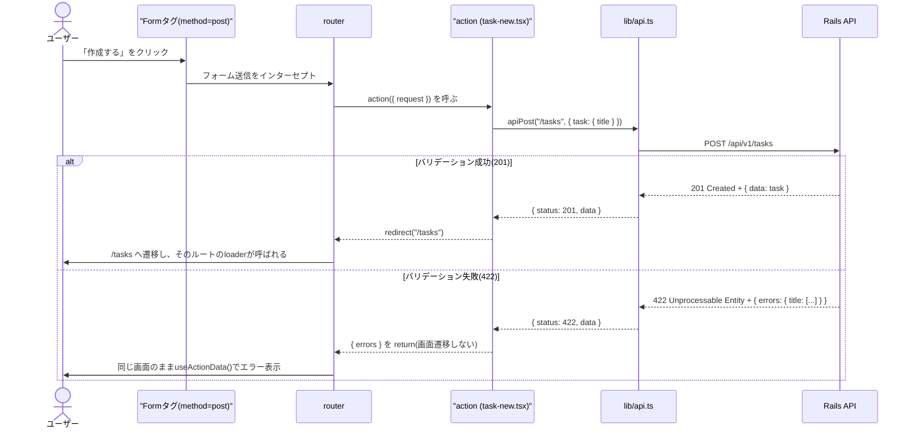
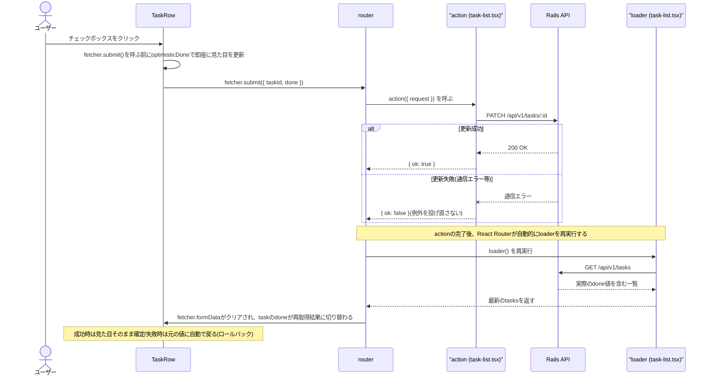
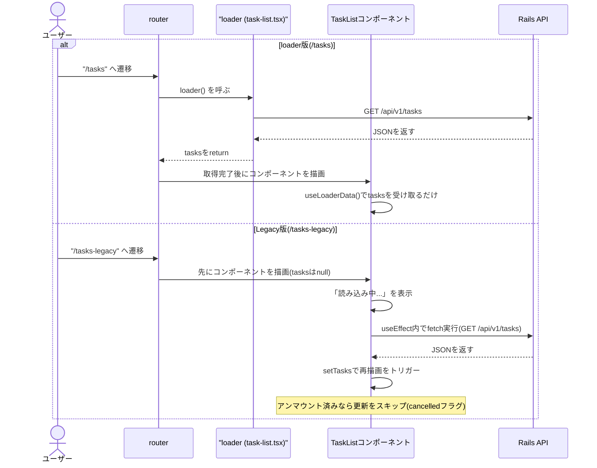
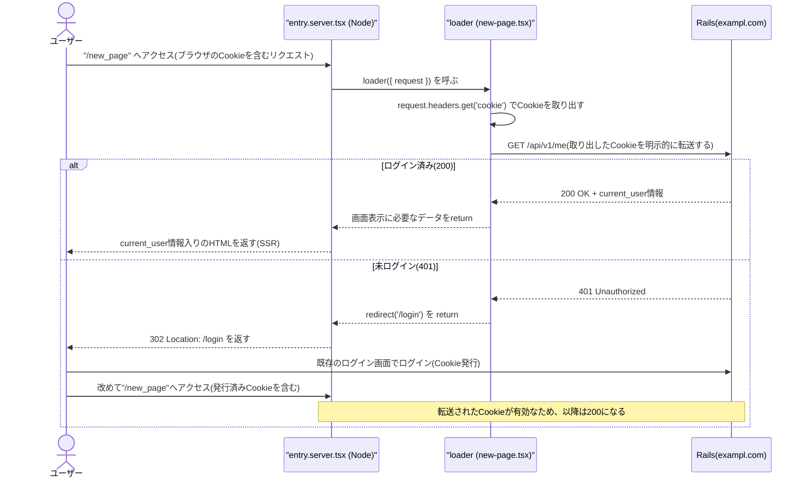
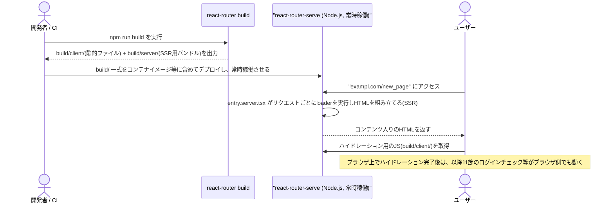

# フロントエンド構成ガイド(Railsエンジニア向け)

このドキュメントは、Railsエンジニアのチームに React Router v8 の導入を検討して
もらうために、`frontend/` ディレクトリの構成と設計思想を Rails の概念と対応付け
ながら説明するものです。

本ドキュメントは当初 Data Mode(SPA、SSRなし)を前提に書かれていましたが、
将来的な SEO 対策を見据えて **Framework Mode(SSR)へ移行**したため、
現在の記述はすべて移行後(Framework Mode)の構成を前提にしています。
Data Mode と比べて何が変わったか要点だけ知りたい場合は、10節
(Next.jsとの比較・実行コンテキスト・`lib/api.ts` の設計)を参照してください。

検証結果そのもの(採用可否の所感)は [docs/poc-summary.md](./poc-summary.md)、
Data Mode 時代の実装を進めた際のPR単位のロードマップは
[docs/implementation-plan.md](./implementation-plan.md)、Framework Mode への
移行時のロードマップは
[docs/implementation-plan-framework-mode.md](./implementation-plan-framework-mode.md)
を参照してください。本ドキュメントは「コードを読むための地図」に相当します。

## 1. 全体像

```
frontend/
├── react-router.config.ts       # Framework Mode設定({ ssr: true }。全ルートSSR)
├── vite.config.ts               # Vite設定(@react-router/dev/vite の reactRouter())
├── vitest.config.ts             # テスト実行専用のVite設定(後述14節)
└── app/
    ├── root.tsx                  # 最上位レイアウト(config/application.rb + layout相当)
    ├── routes.ts                 # ルーティング定義(config/routes.rb 相当)
    ├── entry.server.tsx           # サーバー側レンダリングエントリ(SSRの実体)
    ├── entry.client.tsx           # ブラウザ側ハイドレーションエントリ
    ├── routes/                   # 画面 + loader/action/meta(コントローラ+ビュー相当)
    │   ├── top-page.tsx
    │   ├── task-list.tsx         # 一覧画面(index相当) + 完了切り替え
    │   ├── task-new.tsx          # 作成画面(new/create相当)
    │   ├── task-show.tsx         # 詳細画面(show/destroy相当)
    │   ├── *.module.css          # 画面ごとのスタイル(CSS Modules)
    │   └── *.test.tsx            # Vitestによるコンポーネントテスト
    ├── routes-legacy/
    │   └── task-list-legacy.tsx  # 比較用: useEffect + fetch の素朴な書き方
    ├── lib/
    │   └── api.ts                # Rails APIを呼ぶ共通関数(ApplicationController的な共通処理)
    └── assets/                   # import して使う画像
```
(`public/` は Data Mode時代と変わらず、そのまま配信される静的ファイル置き場です)

Rails でいうと、`routes.ts` が `config/routes.rb`、`routes/` 配下の
各ファイルが「コントローラのアクション1つ+対応するビュー1つ」を1ファイルに
まとめたもの、とイメージすると理解しやすいです。`root.tsx` は
`application.html.erb` に近い、全ページ共通の土台(後述16節)。`entry.server.tsx` /
`entry.client.tsx` はRails側に直接対応する概念がなく、「1リクエストごとにHTMLを
組み立てるサーバー処理」と「そのHTMLにイベントハンドラを後付けするブラウザ処理」
という、SSRを実現するための配線部分だと捉えてください(詳細は10-2節)。

### 全体の処理フロー(概念図)

ブラウザ操作の種類によって、React Router がどの処理(`loader` / `action` /
`useFetcher`)を呼び分けるかを図にすると次のようになります。

図中の「router」は、Framework Mode がルーティングの実行時処理を担う部分を
指す表記です。具体的には、初回アクセス時は `entry.server.tsx` の
`<ServerRouter>` が、ブラウザでのハイドレーション後は `entry.client.tsx` の
`<HydratedRouter>` が、`routes.ts` の定義に基づいて実際にURL変化や
フォーム送信を検知し、`loader` / `action` を呼び分けたり結果をコンポーネントに
渡したりします(Data Mode時代の `createBrowserRouter([...])` が返す
`router` オブジェクトに相当する働きですが、Framework Modeではその実体が
`routes.ts` 側のファイルベースの規約とサーバー/クライアント2つのエントリに
分かれています)。「React Router」というライブラリ名そのものと区別するため、
図では `router` と表記しています。

初回アクセス(SSR)については10-2節で別途詳しく説明するため、この図では
Data Mode時代と変わらない「ハイドレーション後のブラウザ内での動き」を
表しています。



ポイントは、**`action` が完了すると React Router が自動的に同じルートの
`loader` を再実行する**ことです。これにより「更新後は常に最新のサーバー側の
値が画面に反映される」ことが保証され、`useFetcher` の楽観的UIの
ロールバックもこの仕組みの上に成り立っています(詳細は後述)。この挙動は
Data Mode・Framework Modeのどちらでも変わりません。

## 2. Rails の概念との対応表

| Rails | React Router v8 (Framework Mode) | 備考 |
|---|---|---|
| `config/routes.rb` | `frontend/app/routes.ts` | パスとルートファイルの対応表 |
| `resources :tasks` の `index` / `show` | `loader`(ルートファイルの `export` ) | 画面表示前に呼ばれ、取得結果を画面に渡す |
| `resources :tasks` の `create` / `update` / `destroy` | `action`(ルートファイルの `export` ) | フォーム送信・`useFetcher`送信を受けて実行される |
| `params[:id]` | `params.id`(loader/actionの引数) | 動的セグメント `:id` の値 |
| ビュー(`.erb`) | ルートコンポーネント(`.tsx`) | 画面の見た目を組み立てる部分 |
| ストロングパラメータ | `request.formData()` | フォーム送信されたデータの取り出し |
| `render json: { errors: ... }, status: 422` | `useActionData()` で受け取るエラー | 後述 |
| Turbo Frames / Stream的な部分更新 | `useFetcher()` | 画面遷移せずに一部だけ更新 |
| `ApplicationController` の共通処理 | `lib/api.ts` | fetchの共通ラッパー |
| `application.html.erb` | `app/root.tsx` | 全ページ共通の `<html>` の土台(16節) |
| `<%= yield %>` | `<Outlet />` | 親レイアウトの中で子ルートが描画される位置(16節) |
| `render layout: false` 等、レンダリング自体の制御 | `entry.server.tsx` / `entry.client.tsx` | Rails側に直接対応する概念はない。SSR/ハイドレーションの配線部分(10-2節) |

## 3. ルーティング定義: `routes.ts`

Rails の `config/routes.rb` に相当するファイルです。URLパスごとに
「どのファイル(コンポーネント)を描画するか」を1箇所に集約しています。

```ts
// frontend/app/routes.ts
import { type RouteConfig, index, route } from '@react-router/dev/routes'

export default [
  index('routes/top-page.tsx'),          // "/" 相当
  route('tasks', 'routes/task-list.tsx'), // "/tasks" 相当。GET一覧 + PATCHでの完了切替
  route('tasks/new', 'routes/task-new.tsx'),   // "/tasks/new" 相当。POSTでの作成
  route('tasks/:id', 'routes/task-show.tsx'),  // "/tasks/:id" 相当。GET詳細 + DELETE
  route('tasks-legacy', 'routes-legacy/task-list-legacy.tsx'), // 比較用(9節)
] satisfies RouteConfig
```

Data Mode時代の `router.tsx`(`createBrowserRouter([{ path, Component, loader,
action }, ...])`)との最大の違いは、**`loader` / `action` をこのファイル側から
明示的に渡すのではなく、紐付けたルートファイルが `export` している
`loader` / `action` という**固定名の関数**をReact Routerが自動的に拾う**という
規約になっている点です。そのため、たとえば `taskListLoader` のような
任意の名前を付けることはできず、必ず `loader` / `action` という名前で
`export` する必要があります(4節・5節のコード例を参照)。

`resources :tasks` のように一括生成するのではなく、パスごとに明示的に
`route()` を列挙する(ファイルベースルーティングを使わない)点は
Data Mode時代から変わらない方針です。

## 4. `loader`: 画面表示前のデータ取得(index / show 相当)

`loader` は「そのルートに遷移する直前に呼ばれ、戻り値が画面から
`useLoaderData()` で参照できる」関数です。Railsで言えば、コントローラの
`index` アクションで `@tasks = Task.all` した結果をビューが `@tasks` として
参照できる、という関係に近いです。

```tsx
// frontend/app/routes/task-list.tsx
export async function loader(): Promise<Task[]> {
  const response = await apiGet<TasksResponse>('/tasks')
  return response.data
}

function TaskList() {
  // loaderの戻り値をそのまま受け取れる。fetchやローディング状態管理は不要。
  const tasks = useLoaderData<typeof loader>()
  // ...
}
```

詳細画面では `:id` の値を `params` から受け取ります(`params[:id]` 相当)。

```tsx
// frontend/app/routes/task-show.tsx
import type { Route } from './+types/task-show'

export async function loader({ params }: Route.LoaderArgs): Promise<Task> {
  const response = await apiGet<TaskResponse>(`/tasks/${params.id}`)
  return response.data
}
```

`Route.LoaderArgs` は `react-router typegen`(`npm run dev` / `npm run build`
実行時に自動実行される。単体で実行したい場合は `npm run typecheck`)が
`routes.ts` の定義から**ルートごとに**生成する型で、ルートファイルと同じ階層の
`./+types/<ファイル名>` から import します。汎用の `LoaderFunctionArgs` と違い、
このルートのパス(`tasks/:id`)から `params.id` が「存在するかもしれない
string」ではなく「必ず存在する string」として自動的に推論される点が違います
(18節も参照)。

Rails のコントローラと違い、`loader` は **Reactコンポーネントの外にある
ただの非同期関数**です。ルーティングの仕組み(React Router)を経由せずに
直接呼び出して単体テストできる、という利点があります(後述のテストの項参照)。

なお、Framework Mode では `loader` の実行場所(サーバー/ブラウザ)がURLへの
アクセス方法によって変わります。詳細は10-2節で説明しますが、以下の図・
コードは Data Mode時代と同じ「ブラウザ内での画面遷移」を前提にしています。

### loaderの処理フロー(`/tasks/:id` に遷移した場合)



タスクが存在しない場合は `apiGet` が `ApiError` を投げ、`loader` 内でも
catch していないため、React Router のデフォルトのエラー画面に委ねられます。

## 5. `action`: フォーム送信の処理(create / update / destroy 相当)

`<Form method="post">` が送信されると、そのルートに紐付いた `action` が
自動的に呼ばれます。Railsの `create` / `update` / `destroy` アクションに
近い役割です。

```tsx
// frontend/app/routes/task-new.tsx (作成 = create相当)
import type { ActionFunctionArgs } from 'react-router'

export async function action({ request }: ActionFunctionArgs) {
  const formData = await request.formData()
  const title = formData.get('title')

  const { status, data } = await apiPost<{ data: Task } | { errors: TaskErrors }>('/tasks', {
    task: { title },
  })

  if (status === 422) {
    // Railsのバリデーションエラーをそのまま画面に返す
    return data as { errors: TaskErrors }
  }

  // 成功時は一覧画面へリダイレクト(Rails の redirect_to 相当)
  return redirect('/tasks')
}
```

`loader` と同様、`routes.ts` で紐付けたファイルが `export` している
`action` という固定名の関数が自動的にこのルートの `action` として使われます
(3節参照)。

画面側では `useActionData()` で `action` の戻り値を受け取り、フォームに
エラーメッセージを表示します。

```tsx
function TaskNew() {
  const actionData = useActionData<typeof action>()
  const titleErrors = actionData?.errors?.title
  // titleErrors を <ul> で表示...
}
```

削除は `destroy` 相当で、成功後に一覧へリダイレクトします。`:id` を含む
ルートなので、`loader` と同じく typegen 由来の `Route.ActionArgs` で
型付けしています(4節参照)。

```tsx
// frontend/app/routes/task-show.tsx
import type { Route } from './+types/task-show'

export async function action({ params }: Route.ActionArgs) {
  await apiDelete(`/tasks/${params.id}`)
  return redirect('/tasks')
}
```

### actionの処理フロー(タスク作成・バリデーションエラーの分岐)



Rails の「保存に成功したら `redirect_to`、失敗したら `render :new`」という
分岐と対応関係にあることが図からも分かります。

## 6. `useFetcher()`: 画面遷移を伴わない部分更新(Turboの部分更新に近い)

一覧画面のチェックボックス(完了/未完了の切り替え)のように、「ページ全体は
そのまま、裏側の一部データだけ更新したい」場合に使うのが `useFetcher()` です。
Hotwire/Turbo の Frame・Stream で部分更新するイメージに近いですが、
React コンポーネントの中で完結します。

```tsx
// frontend/app/routes/task-list.tsx
function TaskRow({ task }: { task: Task }) {
  const fetcher = useFetcher<typeof action>()

  // 送信中は「送信しようとしている値」を先に表示する(楽観的UI)
  const optimisticDone = fetcher.formData ? fetcher.formData.get('done') === 'true' : task.done

  const handleToggle = () => {
    fetcher.submit(
      { taskId: String(task.id), done: String(!optimisticDone) },
      { method: 'post', action: '/tasks' },
    )
  }

  return (
    <input type="checkbox" checked={optimisticDone} disabled={fetcher.state !== 'idle'} onChange={handleToggle} />
  )
}
```

更新が失敗した場合、`action` はエラーを投げ直さずに `{ ok: false }` を返すだけに
とどめています。React Router が `action` 完了後に自動的に `loader` を
再実行するため、実際のサーバー側の値に表示が同期し直され、結果的に
「失敗したら元の表示に戻る(ロールバック)」が特別なコードなしで実現されます。

```tsx
export async function action({ request }: ActionFunctionArgs) {
  // ...
  try {
    await apiPatch(`/tasks/${taskId}`, { task: { done } })
    return { ok: true }
  } catch {
    return { ok: false } // 例外を投げ直すとエラー画面に飛んでしまうため避ける
  }
}
```

### useFetcherの処理フロー(楽観的UI更新とロールバック)

チェックボックスをクリックしてから画面に最終的な値が反映されるまでの
流れです。「成功時」と「失敗時」で表示がどう収束するかがポイントです。



「失敗したら元に戻す」ための特別なコード(前の値を覚えておいて戻す、等)を
書かずに済んでいるのは、`action` 完了後に `loader` が必ず再実行される
React Router の仕組みに乗っているためです。

## 7. `lib/api.ts`: Rails API呼び出しの共通ラッパー

各コンポーネントで直接 `fetch()` を書かず、必ずこのファイルを経由します。
`ApplicationController` に共通処理をまとめる感覚に近いです。

```ts
// frontend/app/lib/api.ts
function resolveApiBaseUrl(): string {
  const isServer = typeof document === 'undefined'

  if (isServer) {
    const baseUrl = process.env.API_BASE_URL_INTERNAL
    if (!baseUrl) {
      throw new Error('API_BASE_URL_INTERNAL が設定されていません。...')
    }
    return baseUrl
  }

  return import.meta.env.VITE_API_BASE_URL ?? 'http://localhost:3000/api/v1'
}

export async function apiGet<T>(path: string): Promise<T> {
  const response = await fetch(`${resolveApiBaseUrl()}${path}`)
  if (!response.ok) {
    throw new ApiError(response.status, `API request failed: GET ${path} (${response.status})`)
  }
  return response.json() as Promise<T>
}
```

Data Mode時代はベースURLが `VITE_API_BASE_URL` の1つだけで済んでいましたが、
Framework Mode では `loader` / `action` がサーバー(Node プロセス)・ブラウザの
どちらでも実行されうるため(10-2節)、`resolveApiBaseUrl()` で実行場所ごとに
参照する環境変数を切り替えています。なぜ2つのベースURLが必要なのか、
具体的な値やフォールバックの非対称性については **10-3節で詳しく説明**して
いるので、ここでは「単純な定数ではなく、呼び出しごとに実行場所を判定する
関数になった」という変化だけ押さえてください。

ポイントは **GET と POST/PATCH でエラーの扱い方を分けている**ことです
(この点はベースURLの解決方法が変わっても同じです)。

- `apiGet`: 失敗(4xx/5xx)は問答無用で例外(`ApiError`)を投げる
- `apiPost` / `apiPatch`: 422(バリデーションエラー)だけは例外にせず
  `{ status, data }` として呼び出し元(`action`)にそのまま返す
  (Railsが `render json: { errors: ... }, status: :unprocessable_entity` した
  内容を、`action` 側で「フォームに表示すべき結果」として扱えるようにするため)
- `apiDelete`: Rails が `204 No Content` を返す前提で、ボディを読まずに
  ステータスだけ返す(`response.json()` を呼ぶとパースエラーになるため)

## 8. `react-router` からのみ import する

このリポジトリでは `react-router-dom` は使用禁止です(v8で廃止されたパッケージ)。
すべて `react-router` から import します。

```tsx
import { Form, Link, redirect, useLoaderData, useFetcher } from 'react-router'
```

## 9. 比較用の `routes-legacy/`: 素の `useEffect` + `fetch` との違い

`loader` を使わない従来型の書き方(Declarative Mode)も比較用に1画面
(`/tasks-legacy`)だけ残してあります。同じ一覧表示でも、`loader` 版が
存在しないボイラープレートが必要になる点が分かります。

```tsx
// frontend/app/routes-legacy/task-list-legacy.tsx
function TaskListLegacy() {
  const [tasks, setTasks] = useState<Task[] | null>(null)
  const [error, setError] = useState<string | null>(null)

  useEffect(() => {
    let cancelled = false
    apiGet<TasksResponse>('/tasks')
      .then((response) => { if (!cancelled) setTasks(response.data) })
      .catch((err) => { if (!cancelled) setError(/* ... */) })
    return () => { cancelled = true } // アンマウント後の状態更新を防ぐガード
  }, [])
  // ...
}
```

`loader` 版(`task-list.tsx`)にはこの `useState` × 2、`useEffect`、
キャンセル用フラグが一切登場しません。「取得済みのデータをどう表示するか」
だけに専念できるのが `loader` の利点です。

### loader版とLegacy版の流れの違い(ブラウザ内遷移の場合)

同じ「一覧画面を表示してAPIを叩く」処理でも、データ取得のタイミングと
状態管理の主体がどちらにあるかが異なります。以下はData Mode時代と変わらない
「ハイドレーション後、ブラウザ内でリンクをクリックして遷移した場合」の流れです。



loader版は「取得してから描画する」、Legacy版は「先に描画してから
コンポーネント内で取得する」という順序の違いがあり、これがそのまま
ローディング状態やキャンセル処理を自前で書く必要があるかどうかの差に
つながっています。

### 初回アクセス(SSR)時の違い: SEO効果の有無

上記はブラウザ内遷移の話でしたが、Framework Mode 移行後は**初回アクセス時
(`curl` 等でJSを実行せずにアクセスした場合)の挙動にも両者で明確な差**が
生まれています。

- `/tasks`(loader版): `loader` がサーバー側で実行され、その結果を使って
  `<ul>` 等の一覧HTMLと `<title>タスク一覧 | rr8-rails-poc</title>` が
  **JS実行前の生HTMLに直接含まれます**(10-2節・17節参照)。
- `/tasks-legacy`(Legacy版): この画面は `loader` を持たないため、SSR自体は
  行われるものの埋め込むデータがなく、サーバーが返すHTMLは「読み込み中...」の
  空の状態のままです。実際のタスク一覧は、ブラウザでハイドレーションされた後の
  `useEffect` 内でしか取得されません。またこの画面は意図的に `meta()` も
  `export` していないため、`<title>` も一覧の中身に関わらず固定のままです
  (root.tsxのフォールバック。詳細は10-3節・root.tsxのコメント参照)。

つまり `/tasks-legacy` は「SSRされているが、SSRの恩恵(検索エンジンに実際の
コンテンツが見える)を受けられていない」画面になっており、SSR対応が
「サーバーでレンダリングされるかどうか」だけでなく「その時点で必要なデータを
持っているかどうか」にも懸かっている、という点を対比的に示す役割を
担っています。

## 10. Next.js との比較、そして採用した Framework Mode(SSR)構成

このリポジトリは当初 React Router v8 の Data Mode(SPA、SSRなし)のみを採用する
方針でしたが、将来的な SEO 対策を見据えて **Framework Mode(SSR)へ移行**しました
(移行の経緯・確定方針は `docs/implementation-plan-framework-mode.md` を参照)。
以前このセクションには「SSR は不要」という結論を書いていましたが、それは撤回します。
以下では、まず Next.js との対比で Framework Mode の位置付けを補足し、続けて
`loader` / `action` の実行コンテキストの違いと、それに起因する `lib/api.ts` の設計を
説明します。

### 10-1. Next.js (App Router) との対比

「フロントエンドのモダンな構成」というと Next.js(App Router)を思い浮かべる方も
多いと思うので、React Router v8 の Framework Mode と Next.js の違いを対比で補足します。

| 観点 | Next.js (App Router) | React Router v8 (Framework Mode) |
|---|---|---|
| 実行環境 | Node.js サーバーが必須(Vercel or 自前サーバーでSSR実行) | 同じく Node.js サーバーが必須(`react-router-serve` 等でSSR実行。Data Mode時代の「静的ファイルのみで配信可」ではなくなった) |
| ルーティング定義方法 | `app/` 配下のディレクトリ構造がそのままルーティングになる(ファイルベース) | `routes.ts` に `route()` / `index()` で配列として明示的に列挙(集中管理。ファイルベースルーティングは使わない方針は変更なし) |
| データ取得 | Server Component 内で直接 DB/ORM を呼べる(`await db.query()` 等) | `loader` は必ず `fetch`(`lib/api.ts` 経由)でRails APIを呼ぶ(HTTP境界を越える) |
| 更新処理 | Server Actions(`"use server"`)がクライアントから直接呼べるRPC関数になる。フロントとバックエンドの境界が曖昧になる | `action` は `fetch` でRails APIにリクエストを送るだけ。処理の実体は常にRails側 |
| フロント/バックエンドの分離 | Server Component / Server Action がバックエンド処理を兼ねるため、Railsのような「別プロセスのAPI」という区分けが薄れる | フロントは常にRails APIのクライアント、バックエンドは常にRails API、という役割分担が明確 |
| このリポジトリでの位置付け | 不採用(Next.jsへの全面移行は検討していない) | 採用済み。既存のRails(API)+フロントを、SEO対策のためFramework Mode(SSR)構成に移行した |

ポイントは、**Next.js は「フロントエンドとバックエンドを1つのNode.jsアプリに
統合する」方向の設計**であるのに対し、**React Router v8 の Framework Mode は
「Railsが担ってきたAPIサーバーの役割はそのままに、フロントエンドのレンダリング場所
(サーバー/ブラウザ)だけを両対応にする」方向の設計**である点です。Data Mode
からの変化は「SSRが増えたこと」であって、「Railsの役割が減ったこと」ではありません。
`loader` / `action` は Server Component / Server Action のように直接データベースや
業務ロジックにアクセスすることはなく、Framework Mode 移行後も変わらず
`lib/api.ts` を経由してRails APIにHTTPリクエストを送ります(3〜5節で説明した内容と
同じです)。

言い換えると、Next.jsの`loader`相当(Server Component)は「Railsのコントローラを
JavaScript側に持ってくる」構成に近く、React Router v8の`loader`は「Railsの
コントローラはRails側に残したまま、それを呼び出すクライアントのレンダリング方式を
差し替える」構成に近い、と捉えると馴染みやすいと思います。

SSR化のトレードオフとして、Node.js サーバーの運用コスト(デプロイ・スケーリング・
監視対象の増加。Data Mode時代は静的ファイル一式をNginx等で配信するだけで済んでいた)
は増えましたが、初回 HTML にコンテンツと `<title>`/`<meta>` を含められる点がSEO上
不可欠であるため、このトレードオフを受け入れる判断をしています。

### 10-2. `loader` / `action` の実行コンテキスト: サーバーとブラウザの2箇所

Data Mode(SPA)では `loader` / `action` は常にブラウザの中(Reactアプリの実行環境)
だけで動いていました。Framework Mode ではこれが**サーバー(Node プロセス)側でも
実行されうる**ようになる点が、最も注意が必要な違いです。

- **初回アクセス時 / ブラウザで直接URLを叩いた時**: `entry.server.tsx` が
  リクエストごとに呼ばれ、該当ルートの `loader` はサーバー側(frontendコンテナ内の
  Node プロセス)で実行されます。ここで取得したデータを埋め込んだ状態の HTML が
  レスポンスとして返るため、`curl` で取得しても中身入りのHTMLになります(= SSR)。
- **リンククリック等の画面遷移時**: 一度ページがハイドレーション
  (`entry.client.tsx` の `hydrateRoot()`)された後の遷移は、Data Mode時代と同様
  ブラウザ側で `loader` / `action` が実行されます(裏側でRails APIに直接fetchする)。

つまり同じ `loader` 関数が、リクエストのタイミングによってサーバー・ブラウザの
どちらでも実行される可能性があります。この違いが問題になるのが、次に説明する
「Rails APIのURL」です。サーバー側のNodeプロセスと、ブラウザは、同じ
`http://backend:3000/...` というURLに対して異なる意味を持ちます(サーバー側は
Dockerネットワーク内のホスト名として解決できますが、ブラウザ側は `backend` という
ホスト名をそもそも解決できません)。

### 10-3. `lib/api.ts` がなぜ2つのベースURLを持つか

上記の理由により、`lib/api.ts` はRails APIのベースURLを実行コンテキストに応じて
切り替える設計になっています(`resolveApiBaseUrl()` 関数。実装コメントも参照)。

| 実行コンテキスト | 参照する環境変数 | 値の例 | 理由 |
|---|---|---|---|
| サーバー(Node プロセス、frontendコンテナ内) | `API_BASE_URL_INTERNAL`(`process.env` 経由) | `http://backend:3000/api/v1` | `localhost` はコンテナ自身を指してしまいbackendコンテナに届かない。`docker-compose.yml` の `DB_HOST: db` と同じ考え方で、コンテナ間はサービス名 `backend` で疎通する |
| ブラウザ | `VITE_API_BASE_URL`(`import.meta.env` 経由) | `http://localhost:3000/api/v1` | ブラウザ自身から見えるURLが必要。`docker-compose.yml` で `backend` サービスがホストの `3000` 番に公開されているため `localhost:3000` でアクセスできる |

`typeof document === 'undefined'` でどちらの実行コンテキストか判定し(`document` は
ブラウザにのみ存在するグローバルオブジェクト)、サーバー側では設定漏れに気付けるよう
`API_BASE_URL_INTERNAL` 未設定時に明示的にエラーを投げる一方、ブラウザ側では
`VITE_API_BASE_URL` 未設定時も `http://localhost:3000/api/v1` にフォールバックする
非対称な作りになっています。これはサーバー側には「とりあえず動く」デフォルト値を
安全に用意できない(`localhost` はコンテナ自身を指してしまうため)一方、ブラウザ側の
`localhost:3000` は開発時のデフォルト構成として妥当だからです。

なお `API_BASE_URL_INTERNAL` には(`VITE_API_BASE_URL` と違い)あえて `VITE_` prefix を
付けていません。Viteの仕様上、`VITE_` prefixが付いた環境変数だけがビルド時に
クライアントのJSバンドルへ埋め込まれるため、サーバー専用の値に `VITE_` を付けてしまうと
ブラウザ向けバンドルに漏れ出してしまいます(実害は薄いものの、意図しない情報漏洩を
避けるため区別しています)。

ベースURLの解決はモジュール読み込み時に1回だけ行うのではなく、`apiGet` 等の呼び出し
時に毎回評価しています。`lib/api.ts` は `loader` / `action` だけでなく
`routes-legacy/task-list-legacy.tsx`(素の `useEffect` + fetch。10-2で説明した通り
SSR自体はされるが、API呼び出しはブラウザの `useEffect` でのみ発生する)からも
importされるため、モジュール読み込み時点で `API_BASE_URL_INTERNAL` 未設定を
例外にしてしまうと、本来Rails APIを呼ばない `/` や `/tasks-legacy` のSSRまで
巻き込んで失敗させてしまいます。呼び出し時まで評価を遅延させることで、この
巻き込みを避けています。

## 11. ログイン処理について(オプション要件・将来の検討事項)

本PoCは CLAUDE.md に明記の通り「認証は一旦なし」がスコープであり、ここまでの内容は
すべて未ログイン前提です。ただし将来的な採用検討の材料として、**具体的なシナリオを
想定したときにログイン処理をどう設計するか**を整理しておきます。

想定シナリオ: 既存の本番Railsサービス `exampl.com`(ビュー・セッションCookieによる
ログイン機能を既に持つ)に対し、`exampl.com/new_page` という1画面だけを
React Router v8(Framework Mode)で新規に作る場合。

### 11-1. 前提: 同一オリジンでの配信を推奨する

`exampl.com/new_page` は**サブドメインではなくパス**である点がポイントです。
`app.exampl.com` のような別オリジンに切り出すのではなく、リバースプロキシ
(nginx/ALBのパスルーティング等)で `/new_page` 配下だけをビルド済みの
React Router側に振り分ける、あるいはRails自身がビルド成果物を配信する形にして
**同一オリジンで配信する**ことで、Cookie共有やCORSまわりの複雑さを避けられます。

| | 同一オリジン配信(推奨) | 別オリジン配信(サブドメイン等) |
|---|---|---|
| Cookie送信 | ブラウザが自動送信(特別な設定不要) | `SameSite=None; Secure` + `credentials: 'include'` が必要 |
| CORS設定 | 不要(そもそもクロスオリジンにならない) | `rack-cors` 側で許可オリジン・`credentials: true` の設定が必要 |
| CSRF | 必要(11-4節参照) | 必要(さらにcrossOriginな分、設計の難易度が上がる) |

本PoCの開発環境(frontend: `localhost:5173` / backend: `localhost:3000`)は
別オリジン構成の一例ですが、認証を実装していないためこの問題が表面化していません。
本番相当の構成を検討する際は、上表の「同一オリジン配信」を前提にするのが
シンプルだと考えられます。

### 11-2. ログイン状態の共有: セッションCookieがそのまま使える(ブラウザ実行時)

同一オリジン配信であれば、`exampl.com` の既存ログイン(Devise等によるセッション
Cookie発行)がそのまま利用できます。ブラウザの `fetch()` は**同一オリジンへの
リクエストであればデフォルトでCookieを送信する**(`credentials: 'same-origin'` が
既定値)ため、`credentials: 'include'` を明示しなくても `loader` / `action` からの
APIリクエストにログイン中のセッションCookieが自動的に付与されます。

現在の `frontend/app/lib/api.ts` はクロスオリジン(別オリジン)向けの構成のため
`credentials` オプションを指定していませんが、同一オリジン配信に切り替えた場合は
コードを変更しなくてもCookieが送信されます(意図を明示したい場合は
`credentials: 'same-origin'` を書いてもよいでしょう)。これはトークンをlocalStorageで
管理したりOAuthフローを組んだりする必要がない、という意味でこの構成の大きな利点です。

**ただしこれはあくまで `loader` / `action` が「ブラウザ側」で実行される場合
(ハイドレーション後の画面遷移。10-2節参照)の話です。** Framework Mode 移行に
伴い、`loader` は初回アクセス時に**サーバー(Node プロセス)側**でも実行され
うるようになりました。この場合にAPIへ送られるのはブラウザの `fetch` ではなく
Node プロセスの `fetch` によるリクエストであり、ブラウザが自動的にCookieを
付与してくれる仕組みの外側にあるため、**「同一オリジンなら自動送信」という
挙動は成り立ちません**。サーバー側で実行される `loader` / `action` で
ログイン状態を扱いたい場合は、React Routerが渡してくる `request`(ブラウザから
届いた元のリクエスト)から `Cookie` ヘッダを読み取り、Rails APIへのリクエストに
明示的に転送する必要があります。

```tsx
// frontend/app/routes/new-page.tsx (将来のイメージ。未実装)
export async function loader({ request }: Route.LoaderArgs) {
  // ブラウザから届いた元のリクエストのCookieヘッダをそのままRails APIへ転送する。
  // サーバー(Node)側の fetch はブラウザと違い、Cookieを自動送信してくれないため。
  const cookie = request.headers.get('cookie')
  const response = await apiGet('/me', { headers: cookie ? { Cookie: cookie } : {} })
  // ...
}
```

(`apiGet` が追加のヘッダを受け取れるようにする、といった `lib/api.ts` 側の
拡張も別途必要になります。あくまで設計の方向性を示すイメージです)

### 11-3. 未ログイン時のハンドリング(loaderでの認可チェック)

`loader` の冒頭で現在のユーザー情報を返すAPI(例: `GET /api/v1/me`)を呼び、
401が返ってきたら未ログインと判断してRailsの既存ログイン画面へ遷移させる、
という設計が考えられます(上記11-2の通り、サーバー実行時はCookie転送も
あわせて必要です)。

```tsx
// frontend/app/routes/new-page.tsx (将来のイメージ。未実装)
export async function loader({ request }: Route.LoaderArgs) {
  const cookie = request.headers.get('cookie')
  const response = await apiGet('/me', { headers: cookie ? { Cookie: cookie } : {} })

  if (response.status === 401) {
    // Railsのログイン画面(/login)はReact Routerの管理外にあるため、
    // React Routerの redirect() ではなく、HTTPレベルのリダイレクトレスポンスで
    // 素のブラウザ遷移(フルページリロード)を起こす必要がある。
    // ※ window.location.href はブラウザにしか存在しないグローバル変数のため、
    //   この loader がサーバー側(Node プロセス)で実行された場合は使えない
    //   (10-2節参照)。サーバー・ブラウザどちらの実行でも動くようにするには、
    //   React Router の redirect() が返す Response をそのまま return する
    //   (React Router自身が「ルーター外への遷移」もHTTPリダイレクトとして
    //   ブラウザに伝播させてくれる)のが実装時の妥当な選択肢になりそうです。
    return redirect('/login')
  }

  // ...ログイン済みの場合の処理
}
```

Data Mode時代のこの節は「`window.location.href` を使えばよい」という
結論でしたが、Framework Mode では `loader` がサーバー側で実行される
可能性がある以上、ブラウザ専用のグローバル変数(`window`)に依存する実装は
そのままでは使えません。`redirect()` はサーバー・ブラウザのどちらで
実行されてもHTTPリダイレクト相当の `Response` を返すだけなので、
実行場所を問わず動く設計にするならこちらを使う方が筋が良い、という
点がFramework Mode移行によって新たに見えてきた検討事項です。

### 11-4. CSRFトークンの扱い

セッションCookieによる認証は、ブラウザがCookieを自動送信してしまう性質上、
状態変更系のリクエスト(`action` からのPOST/PATCH/DELETE)がCSRF(クロスサイト
リクエストフォージェリ)の対象になり得ます。Railsの `--api` モードはデフォルトで
CSRF保護(`protect_from_forgery`)を含まないため、Cookieセッション認証を導入する際は
別途CSRF対策を組み込む必要があります。

具体的には、CSRFトークンを何らかの形でフロントエンドに渡し(例:
ページに埋め込む `<meta name="csrf-token">` タグや専用のトークン取得API)、
`lib/api.ts` 側で `X-CSRF-Token` ヘッダとして付与し、Rails側で検証する、という
方式が一般的です。ただし具体的な実装方式(どのエンドポイントでトークンを配布するか等)は
本ドキュメントの時点では未検討で、実装時に別途設計が必要な項目として残しておきます。

### 11-5. 処理フロー図

初回アクセス(サーバー側で `loader` が実行される)の場合、ブラウザが送った
Cookieを `loader` が明示的にRails APIへ転送する(11-2節)必要がある点が、
Data Mode時代からの一番の変化点です。



### 11-6. Railsの概念との対応表

| Rails | React Router側での扱い |
|---|---|
| `before_action :authenticate_user!` | `loader` 冒頭で `/api/v1/me` を呼び、401なら未ログイン扱いにする |
| `current_user` | 認証チェック用APIのレスポンスとして取得し、必要なら画面に渡す |
| `protect_from_forgery` | `lib/api.ts` でCSRFトークンをヘッダに付与する(要設計、11-4節参照) |
| Deviseのログイン画面(`/login`) | React Routerの管理外。HTTPリダイレクト( `redirect()` )でフルページ遷移させる |
| セッションCookie(ブラウザ実行時) | 同一オリジン配信であれば`fetch`のデフォルト挙動で自動送信される |
| セッションCookie(サーバー実行時) | 自動送信されない。`request.headers.get('cookie')` で明示的に転送する必要がある(11-2節) |

以上はあくまで設計上の検討メモであり、本PoCでは検証していません。
[poc-summary.md](./poc-summary.md) の懸念点にも記載の通り、実際に採用する際は
このドキュメントの内容をもとに、認証を絡めた `loader` / `action` の挙動を
改めて別PRで検証する必要があります。

## 12. デプロイについて(オプション要件・将来の検討事項)

11節(ログイン処理)では「同一オリジンでの配信を推奨する」と述べましたが、
これを実現するには実際にどうビルド成果物を配置すればよいのでしょうか。
本PoCでは**本番デプロイ設定(ECS Fargate等)自体は未実装・スコープ外**
(CLAUDE.md参照)ですが、ローカルでの本番相当ビルド検証(PR19)は実施しており、
それを踏まえて将来検討する際の指針として整理しておきます。

**Data Mode時代からの最大の変更点**: Data Mode(CSR)は「ビルドが完了すれば
あとは静的ファイルを配信するだけ」でしたが、Framework Mode(SSR)では
**リクエストのたびにサーバー側でHTMLを組み立てる必要がある**ため、
**常時稼働するNode.jsプロセスが必須**になりました。以前のこの節では
「Node.jsサーバーの常駐は不要」と説明していましたが、その前提が変わっています。
10節で触れた「SSR化のトレードオフ」が、デプロイの観点で最も具体的に現れる
のがこの節です。

### 12-1. ビルド成果物: クライアント用とサーバー用の2種類

`npm run build`(内部的には `react-router build`)を実行すると、
`frontend/build/` 配下に2つの成果物が出力されます。

- `build/client/` — ブラウザに配信する静的ファイル一式(ハッシュ付きJS/CSS、
  ハイドレーション用の `entry.client.tsx` のバンドルなど)。Data Mode時代の
  `dist/` に近いもの
- `build/server/` — `entry.server.tsx` を中心にした、**Node.js上で動かす
  サーバー用JSバンドル**(`index.js`)。これを実行するプロセスが、リクエストを
  受けるたびに `loader` を呼び、HTMLを組み立てて返す

`npm run start`(`react-router-serve ./build/server/index.js`)が、この
2つを組み合わせて配信するサーバープロセスを起動するコマンドです
(`build/client/` は静的ファイルとして、それ以外のパスは `build/server/`
側でSSRして返す、という振り分けを `@react-router/serve` が内部で行います)。

Railsで言えば `rails assets:precompile` が `public/assets/` 配下に
フィンガープリント付きの成果物(`build/client/` 相当)を作る点は似ていますが、
**Rails自体(常時稼働するアプリケーションサーバー)に相当する部分
(`build/server/` を動かすNode.jsプロセス)が新たに必要になった**、という
違いが本質的です。

### 12-2. ローカルでの本番相当ビルド検証(PR19で実施)

本PoCの `frontend/Dockerfile` は、開発用の `dev` ステージ(`vite dev` によるSSR。
ホットリロードあり)と、本番相当ビルドを検証する `prod` ステージ
(`npm run build` → `npm run start`)のマルチステージ構成になっています。

```dockerfile
# frontend/Dockerfile(抜粋)
FROM base AS prod
RUN npm run build
ENV HOST=0.0.0.0
ENV PORT=3000
EXPOSE 3000
CMD ["npm", "run", "start"]
```

`docker-compose.yml` では、通常の `docker-compose up` には含まれない
opt-inな `frontend-prod` サービス(Compose profile `prod`)として追加してあり、
`docker-compose --profile prod up frontend-prod` で `http://localhost:4000`
からアクセスできます。あくまで**ローカルで本番相当のビルド・配信挙動を
確認するための検証環境**であり、実際の本番デプロイ設定(ECS Fargate等への
反映)ではない点に注意してください。

### 12-3. 配置パターン: リバースプロキシ配下にNodeプロセスを置く

11節の「同一オリジン配信」を実現する方法としては、主に2パターンが
考えられます。いずれも `exampl.com` という同一オリジンを維持できます。
Data Mode時代に検討していた「S3+CloudFrontのような純粋な静的ホスティングに
配置する」パターンは、SSRのために常時稼働するNode.jsプロセスが必要になった
ため選べなくなった点に注意してください(静的ファイルのみのホスティングでは
`loader` を実行できません)。

| パターン | 概要 |
|---|---|
| a. Railsがリバースプロキシ | Rails(またはその手前のnginx/ALB)が `/new_page` 配下のリクエストを、別途起動しておいた `react-router-serve` プロセス(コンテナ)へプロキシする |
| b. リバースプロキシ/ALBで分離 | nginxやALB等のパスベースルーティングで `/new_page/*` を(静的ホスティングではなく)常時稼働するNode.jsサービス(ECS等)へ振り分け、`/api/*` はRailsに振り分ける |

いずれのパターンでも、**Node.jsプロセスをどう常時起動・監視・スケールさせるか**
(ヘルスチェック、再起動、水平スケーリング等)という、Data Mode時代には
存在しなかった運用上の検討事項が新たに発生します。

### 12-4. クライアントサイドルーティングの扱い: キャッチオールは不要になった

Data Mode時代は「`/new_page` 配下のパスはすべて `index.html` を返す
キャッチオール設定が必要」と説明していましたが、これは**Framework Modeでは
不要**です。`react-router-serve`(≒サーバー側のNode.jsプロセス)自体が
`routes.ts` の定義を理解しており、`/new_page/xxx` のようなサブパスへの
直接アクセスやリロードに対しても、そのつどサーバー側で対応する `loader` を
実行して正しいHTMLを都度組み立てて返せるためです。「配下のパスはすべて
同じ `index.html` を返し、実際の画面切り替えはクライアント側のJavaScriptが
行う」という発想自体が、SSR前提の構成には当てはまらなくなりました。

### 12-5. キャッシュ戦略

- `build/client/assets/` 配下のハッシュ付きJS/CSSは、ファイル内容が変われば
  ファイル名も変わるため、長期キャッシュ
  (`Cache-Control: public, max-age=31536000, immutable` など)にして
  問題ありません(ここはData Mode時代と同じ考え方です)。
- 一方、**SSRで返されるHTML自体は「ビルドのたびに変わる静的ファイル」ではなく
  「リクエストごとに動的に生成されるレスポンス」**になったため、Data Mode時代の
  「`index.html` を短期キャッシュ/`no-cache` にする」という単純な話ではなく
  なりました。ページ内容がユーザーやログイン状態によって変わりうる場合、
  そもそもキャッシュ不可(`Cache-Control: private, no-store` 等)にする必要が
  あります。ページ内容が全ユーザー共通で変わらない場合に限り、CDN等での
  短時間キャッシュ(`stale-while-revalidate` 等)を検討する余地はありますが、
  本PoCでは未検証です。

### 12-6. ビルド〜配信の流れ



### 12-7. Railsの概念との対応表

| Rails | フロントエンドのデプロイ(Framework Mode) |
|---|---|
| `public/assets/`(フィンガープリント付き成果物) | `react-router build` が出力する `build/client/` 配下のハッシュ付きJS/CSS |
| `rails assets:precompile` | `npm run build`(`react-router build`) |
| Railsアプリケーションサーバー(Puma等)の常時稼働 | `react-router-serve`(`npm run start`)によるNode.jsプロセスの常時稼働が新たに必要 |
| 通常のルーティング(1URL=1アクション) | `routes.ts` の定義に基づき、サーバー側でリクエストごとに正しいルートを解決する(キャッチオールは不要) |

以上はあくまで設計上の検討メモであり、実際の本番デプロイ設定(ECS Fargate等への
反映、CI/CDへの組み込み)自体は本PoCのスコープ外です。実際に採用する際は、
12-2節のローカル検証を踏まえつつ、Node.jsプロセスの運用(スケーリング・
デプロイ・監視)を別途設計・検証する必要があります。

## 13. CSS・画像の扱い

- スタイルはルート単位で CSS Modules(`task-list.module.css` など)を使用。
  クラス名の衝突を気にせず書けます。
- 画像は2パターン検証済みです。
  - `app/assets/` に置いて `import logo from '../assets/xxx.svg'`
    → ビルド時にハッシュ付きファイル名になる(キャッシュ更新に強い)。
    十分小さいファイル(既定では4KB未満)はファイル出力自体されず、
    JSバンドル内にbase64のdata URLとして埋め込まれる(top-page.tsxで確認済み)
  - `public/` 配下を `"/xxx.svg"` という絶対パスで直接参照
    → ビルド時に一切加工されずそのままコピーされる(ファイル名変更に気付きにくい)。
    Framework Mode移行後もこの挙動は変わらず、`public/` は
    (Data Mode時代の`index.html`が撤去された後も)Viteが引き続き直接配信する
  - 実運用では基本的に `app/assets/` + import 方式を標準にするのが良さそう、
    というのが検証時の所感です(詳細は [poc-summary.md](./poc-summary.md) 参照)。

## 14. テスト: Vitest + Testing Library

`loader` / `action` はプレーンな非同期関数として `export` しているため、
React Router のルーティング機構を経由せずに単体テストできます
(Rails でコントローラのアクションをリクエストスペックでテストするのとは
少し違い、関数単体をテストするイメージに近いです)。

```bash
docker compose exec frontend npm run test
```

**Framework Mode移行に伴う変更点**: テスト実行時の設定ファイルが
`vite.config.ts` から `vitest.config.ts` に分離されました。`vite.config.ts` が
使う `@react-router/dev/vite` の `reactRouter()` プラグインはSSRビルド前提の
変換を行うため、Vitest上での(SSRを介さない)通常のユニットテスト実行とは
相性が良くありません。そのため、素の `@vitejs/plugin-react` を使う専用の
`vitest.config.ts` を用意し、Vitestは存在する場合こちらを優先して読み込む
という仕組みで住み分けています(`test.environment: 'jsdom'` / `setupFiles` の
指定自体はData Mode時代と同じ内容です)。

また、typegen(18節)導入後は `loader` / `action` の型が
`Route.LoaderArgs` / `Route.ActionArgs` という「このルートのパスに特化した
より限定的な型」になったため、`createRoutesStub()`(テスト用にルートツリーを
差し替えるReact Routerのユーティリティ)へそのまま渡そうとすると型エラーに
なるケースがあります。`createRoutesStub` は任意のパスに対応できる汎用の
`LoaderFunction` / `ActionFunction` を期待するため、テストコード側で
`as LoaderFunction` / `as ActionFunction` として型を合わせています
(実行時にはパスが固定なので問題は起きません。`task-show.test.tsx` 参照)。

## 15. エラーバウンダリ: 想定外エラーの扱い(`rescue_from`相当)

ここまでの `loader` / `action` は、Rails APIが422を返すケースなど想定内のエラーは
`status` を見て個別にハンドリングしてきましたが(5節参照)、それ以外の想定外の
エラー(404、500、通信エラーなど)は特に何もキャッチしておらず、React Router
標準のデフォルトエラー画面に任せる形になっています(4節の「タスクが存在しない
場合は `apiGet` が `ApiError` を投げ…React Routerのデフォルトのエラー画面に
委ねられます」という記述の通りです)。

このデフォルト画面を、ルートごとに独自のエラー画面に差し替える仕組みが
**エラーバウンダリ**(`ErrorBoundary`)です。Railsで言えば、`ApplicationController`
の `rescue_from` でコントローラ単位・例外クラス単位にエラーレスポンスを
カスタマイズする仕組みに近いイメージです。

```tsx
// frontend/app/routes/task-show.tsx (追加イメージ。現状のPoCでは未使用)
import { isRouteErrorResponse, useRouteError } from 'react-router'

// loader/action内で投げられた例外や、コンポーネントのレンダリング中に
//発生したエラーを、このコンポーネントがキャッチして表示する。
//
// Framework Modeでは、loader/action/metaと同様に「ErrorBoundary」という
// 固定名でexportしておくだけで、routes.tsでこのファイルに紐付けたルート用の
// エラー画面として自動的に使われる(Data Mode時代のようにrouter.tsx側の
// ルートオブジェクトへErrorBoundary: TaskShowErrorBoundaryのように明示的に
// 渡す必要はない。3節で説明したloader/actionの規約と同じ考え方)。
export function ErrorBoundary() {
  const error = useRouteError()

  // レスポンス由来のエラー(ステータスコード付き)かどうかを判定できる
  if (isRouteErrorResponse(error) && error.status === 404) {
    return <p>タスクが見つかりませんでした</p>
  }

  return <p>予期しないエラーが発生しました</p>
}
```

ポイントは、`ErrorBoundary` を `export` していないルートで発生したエラーは、
**1つ上の階層のルートの `ErrorBoundary`(なければさらに上……最終的には
`root.tsx`)にバブリングしていく**ことです。Railsの `rescue_from` が
`ApplicationController` に書けば全コントローラに継承され、個別のコントローラで
上書きもできるのと似た構造だとイメージすると理解しやすいです(16節で説明する
ネスト構造とも関係します)。

| Rails | React Router v8 (Framework Mode) |
|---|---|
| `rescue_from StandardError`(`ApplicationController`) | `root.tsx` の `ErrorBoundary`(なければReact Router標準のデフォルトエラー画面) |
| コントローラ単位の `rescue_from` 上書き | 特定のルートファイルに `ErrorBoundary` を個別 `export` |
| `render status: 404` | `useRouteError()` + `isRouteErrorResponse()` でステータスに応じて表示を出し分け |

本PoCでは `ErrorBoundary` を明示的に設定しておらず、すべてReact Router標準の
デフォルトエラー画面に委ねています。実運用では、少なくとも404(存在しないID)・
500(サーバーエラー)・通信エラーの3パターン程度は画面ごとに用意しておくのが
良さそうです。

## 16. `Outlet`: 共通レイアウトのネスト構造

すでに1節・2節で少し触れた通り、`root.tsx` の `<Outlet />` の位置に
「現在のURLに対応するルートのコンポーネント」が描画される、という
入れ子構造がFramework Mode全体の土台になっています。今のルート定義
(`routes.ts`)では `/tasks` ・ `/tasks/new` ・ `/tasks/:id` がいずれも
`root.tsx` 直下の子として並んでいるだけですが、これらの画面グループにだけ
共通のヘッダーやフッターを持たせたい場合は、**さらに一段ネストしたレイアウト
ルート**を追加できます。

Railsで言えば、`application.html.erb` の `<%= yield %>` の位置に各アクションの
ビューが差し込まれる仕組みに近いです。`Outlet` が `yield` の役割を果たし、
子ルートに対応するコンポーネントがそこに描画されます。

```tsx
// frontend/app/routes/layout.tsx (追加イメージ。現状のPoCでは未使用)
import { Outlet } from 'react-router'

export default function Layout() {
  return (
    <>
      <Header /> {/* 全画面共通のヘッダー */}
      <Outlet />  {/* 現在のURLに対応する子ルートのコンポーネントがここに描画される */}
      <Footer /> {/* 全画面共通のフッター */}
    </>
  )
}
```

```ts
// frontend/app/routes.ts (ネスト構造にする場合のイメージ)
import { type RouteConfig, index, layout, route } from '@react-router/dev/routes'

export default [
  index('routes/top-page.tsx'),
  // layout()は「URLパスを消費しない」レイアウト専用のネスト
  // (Railsのnamespace/moduleがURLセグメントを追加するのとは異なり、
  // あくまで見た目の入れ子だけを作る点に注意)。
  // 第2引数の配列内のルートは、すべてLayoutコンポーネントの<Outlet/>に描画される。
  layout('routes/layout.tsx', [
    route('tasks', 'routes/task-list.tsx'),
    route('tasks/new', 'routes/task-new.tsx'),
    route('tasks/:id', 'routes/task-show.tsx'),
  ]),
  route('tasks-legacy', 'routes-legacy/task-list-legacy.tsx'),
] satisfies RouteConfig
```

| Rails | React Router v8 (Framework Mode) |
|---|---|
| `application.html.erb` の `<%= yield %>` | 親ルートの `<Outlet />`(`root.tsx` 自体も1段目のレイアウト) |
| `_header.erb` / `_footer.erb` などのパーシャル | `Layout` コンポーネント内の共通UI |
| ネストした `resources`(`resources :tasks do ... end`) | `routes.ts` の `layout()` / `route()` の第3引数(children)によるネスト定義 |

15節の `ErrorBoundary` もこのネスト構造に沿ってバブリングするため、たとえば
`Layout` に共通の `ErrorBoundary` を1つ置きつつ、`/tasks/:id` だけ個別の
`ErrorBoundary` で上書きする、という組み合わせ方もできます。

11節で触れた「`exampl.com/new_page` に既存サービスと統一感のあるヘッダー/フッターを
持たせたい」というケースでは、この `Layout` コンポーネント側にexampl.com既存の
デザインに合わせたヘッダー/フッターを実装する形になります(Rails側がレンダリング
する既存ページのヘッダー/フッターとどう見た目を揃えるかは、デザインシステムの
共有方法も含めて別途の検討が必要です)。

## 17. まとめ

- ルーティング・データ取得・フォーム処理の宣言場所が `routes.ts` に
  集約されるため、「この画面が何をしているか」を追いやすい
- `loader` / `action` によって、Railsのコントローラ的な「画面表示前の準備」
  「送信を受けての処理」という役割分担がそのままフロントエンドに持ち込める
- 422エラーハンドリングや部分更新(`useFetcher`)など、Rails的なフォーム設計と
  相性の良い仕組みが標準で用意されている
- Framework Mode(SSR)への移行により、初回HTMLに実際のコンテンツと
  `<title>`/`<meta>` が含まれるようになりSEO対策が可能になった一方、
  `loader` / `action` の実行場所(サーバー/ブラウザ)を意識した設計
  (`lib/api.ts` のベースURL分岐、11節のCookie転送など)や、常時稼働する
  Node.jsプロセスの運用(12節)が新たに必要になった、というのが
  Data Mode時代からの最大のトレードオフ

採用可否の詳しい所感・懸念点は [docs/poc-summary.md](./poc-summary.md) を
参照してください。
