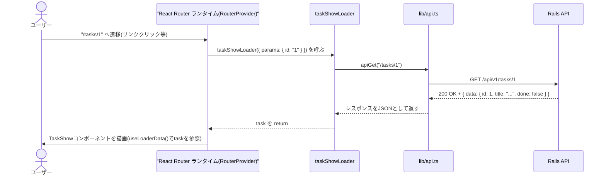
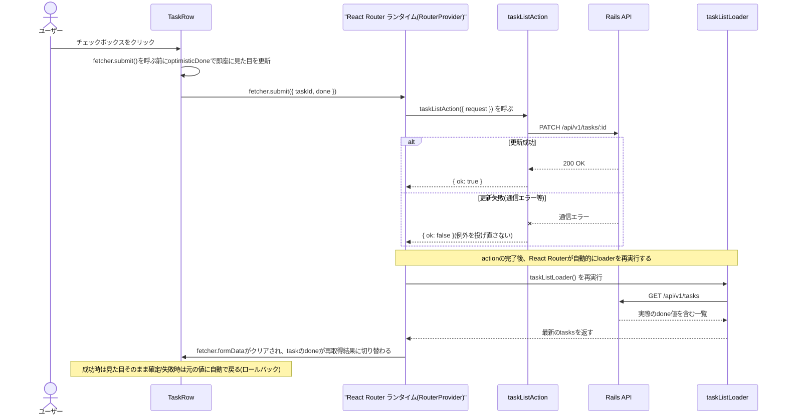
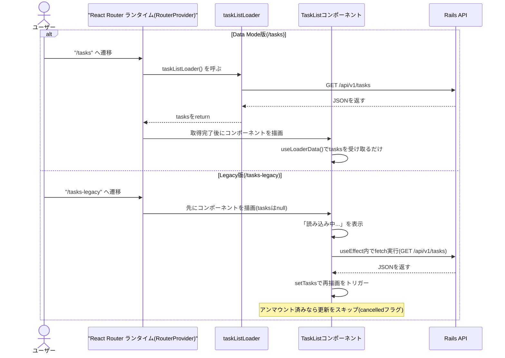

# フロントエンド構成ガイド(Railsエンジニア向け)

このドキュメントは、Railsエンジニアのチームに React Router v8(Data Mode)の
導入を検討してもらうために、`frontend/` ディレクトリの構成と設計思想を
Rails の概念と対応付けながら説明するものです。

検証結果そのもの(採用可否の所感)は [docs/poc-summary.md](./poc-summary.md)、
実装を進めた際のPR単位のロードマップは [docs/implementation-plan.md](./implementation-plan.md)
を参照してください。本ドキュメントは「コードを読むための地図」に相当します。

## 1. 全体像

```
frontend/
├── src/
│   ├── main.tsx                 # エントリーポイント(config/application.rb 的な起点)
│   ├── router.tsx                # ルーティング定義(config/routes.rb 相当)
│   ├── routes/                   # 画面 + loader/action(コントローラ+ビュー相当)
│   │   ├── top-page.tsx
│   │   ├── task-list.tsx         # 一覧画面(index相当) + 完了切り替え
│   │   ├── task-new.tsx          # 作成画面(new/create相当)
│   │   ├── task-show.tsx         # 詳細画面(show/destroy相当)
│   │   ├── *.module.css          # 画面ごとのスタイル(CSS Modules)
│   │   └── *.test.tsx            # Vitestによるコンポーネントテスト
│   ├── routes-legacy/
│   │   └── task-list-legacy.tsx  # 比較用: useEffect + fetch の素朴な書き方
│   ├── lib/
│   │   └── api.ts                # Rails APIを呼ぶ共通関数(ApplicationController的な共通処理)
│   └── assets/                   # import して使う画像
└── public/                       # そのまま配信される静的ファイル(public/相当)
```

Rails でいうと、`router.tsx` が `config/routes.rb`、`routes/` 配下の
各ファイルが「コントローラのアクション1つ+対応するビュー1つ」を1ファイルに
まとめたもの、とイメージすると理解しやすいです。

### 全体の処理フロー(概念図)

ブラウザ操作の種類によって、React Router がどの処理(`loader` / `action` /
`useFetcher`)を呼び分けるかを図にすると次のようになります。

図中の「React Router ランタイム(RouterProvider)」は、`router.tsx` で
定義した設定(パスとcomponent/loader/actionの対応表)をもとに、実際に
URL変化やフォーム送信を検知して `loader` / `action` を呼び分けたり、
その結果をコンポーネントに渡したりする**実行時の仕組み**を指しています。
`main.tsx` の `<RouterProvider router={router} />` がこれを起動しています。
「React Router」というライブラリ名そのものと区別するためにこう呼んでいます。

```mermaid
sequenceDiagram
    actor User as ユーザー
    participant RR as "React Router ランタイム(RouterProvider)"
    participant Handler as "loader / action"
    participant Rails as Rails API
    participant View as 画面(コンポーネント)

    alt リンククリック・URL遷移
        User->>RR: 別ルートへ遷移
        RR->>Handler: loaderを呼ぶ
        Handler->>Rails: fetch(GET)
        Rails-->>Handler: JSONを返す
        Handler-->>RR: 取得結果をreturn
        RR->>View: useLoaderData()で画面に反映
    else "&lt;Form&gt;送信(画面遷移あり)"
        User->>RR: フォーム送信
        RR->>Handler: actionを呼ぶ
        Handler->>Rails: fetch(POST/PATCH/DELETE)
        Rails-->>Handler: JSONを返す
        Handler-->>RR: redirect() またはエラーデータをreturn
        Note over RR,View: redirect()なら遷移先のloaderが呼ばれる<br/>データをreturnならuseActionData()で同じ画面にエラー表示
    else useFetcher().submit()(画面遷移なし)
        User->>RR: fetcher.submit()
        RR->>Handler: 同ルートのactionを呼ぶ
        Handler->>Rails: fetch(PATCH等)
        Rails-->>Handler: JSONを返す
        Handler-->>RR: 結果をreturn
        Note over RR,Handler: actionの完了後、同ルートのloaderが自動的に再実行される
        RR->>Handler: loaderを呼ぶ
        Handler->>Rails: fetch(GET)
        Rails-->>Handler: JSONを返す
        Handler-->>RR: 最新データをreturn
        RR->>View: useLoaderData()で画面に反映(成功時は確定/失敗時はロールバック)
    end
```

ポイントは、**`action` が完了すると React Router が自動的に同じルートの
`loader` を再実行する**ことです。これにより「更新後は常に最新のサーバー側の
値が画面に反映される」ことが保証され、`useFetcher` の楽観的UIの
ロールバックもこの仕組みの上に成り立っています(詳細は後述)。

## 2. Rails の概念との対応表

| Rails | React Router v8 (Data Mode) | 備考 |
|---|---|---|
| `config/routes.rb` | `frontend/src/router.tsx` | パスとコンポーネント・loader・actionの対応表 |
| `resources :tasks` の `index` / `show` | `loader` | 画面表示前に呼ばれ、取得結果を画面に渡す |
| `resources :tasks` の `create` / `update` / `destroy` | `action` | フォーム送信・`useFetcher`送信を受けて実行される |
| `params[:id]` | `params.id`(loader/actionの引数) | 動的セグメント `:id` の値 |
| ビュー(`.erb`) | ルートコンポーネント(`.tsx`) | 画面の見た目を組み立てる部分 |
| ストロングパラメータ | `request.formData()` | フォーム送信されたデータの取り出し |
| `render json: { errors: ... }, status: 422` | `useActionData()` で受け取るエラー | 後述 |
| Turbo Frames / Stream的な部分更新 | `useFetcher()` | 画面遷移せずに一部だけ更新 |
| `ApplicationController` の共通処理 | `lib/api.ts` | fetchの共通ラッパー |

## 3. ルーティング定義: `router.tsx`

Rails の `config/routes.rb` に相当するファイルです。URLパスごとに
「どのコンポーネントを表示するか」「どの `loader` / `action` を紐付けるか」を
1箇所に集約しています。

```tsx
// frontend/src/router.tsx
export const router = createBrowserRouter([
  {
    path: '/tasks',
    Component: TaskList,
    loader: taskListLoader,   // GET /tasks 相当。画面表示前にRails APIから一覧取得
    action: taskListAction,   // useFetcherからのPATCH送信(完了/未完了の切替)を受ける
  },
  {
    path: '/tasks/new',
    Component: TaskNew,
    action: taskNewAction,    // <Form method="post"> の送信(作成)を受ける
  },
  {
    path: '/tasks/:id',
    Component: TaskShow,
    loader: taskShowLoader,   // GET /tasks/:id 相当
    action: taskShowAction,   // 削除フォームの送信を受ける
  },
])
```

`resources :tasks` のように一括生成するのではなく、パスごとに明示的に
`loader` / `action` を紐付ける点が Rails のルーティングと大きく異なります。

## 4. `loader`: 画面表示前のデータ取得(index / show 相当)

`loader` は「そのルートに遷移する直前に呼ばれ、戻り値が画面から
`useLoaderData()` で参照できる」関数です。Railsで言えば、コントローラの
`index` アクションで `@tasks = Task.all` した結果をビューが `@tasks` として
参照できる、という関係に近いです。

```tsx
// frontend/src/routes/task-list.tsx
export async function taskListLoader(): Promise<Task[]> {
  const response = await apiGet<TasksResponse>('/tasks')
  return response.data
}

function TaskList() {
  // loaderの戻り値をそのまま受け取れる。fetchやローディング状態管理は不要。
  const tasks = useLoaderData<typeof taskListLoader>()
  // ...
}
```

詳細画面では `:id` の値を `params` から受け取ります(`params[:id]` 相当)。

```tsx
// frontend/src/routes/task-show.tsx
export async function taskShowLoader({ params }: LoaderFunctionArgs): Promise<Task> {
  const response = await apiGet<TaskResponse>(`/tasks/${params.id}`)
  return response.data
}
```

Rails のコントローラと違い、`loader` は **Reactコンポーネントの外にある
ただの非同期関数**です。ルーティングの仕組み(React Router)を経由せずに
直接呼び出して単体テストできる、という利点があります(後述のテストの項参照)。

### loaderの処理フロー(`/tasks/:id` に遷移した場合)



タスクが存在しない場合は `apiGet` が `ApiError` を投げ、`loader` 内でも
catch していないため、React Router のデフォルトのエラー画面に委ねられます。

## 5. `action`: フォーム送信の処理(create / update / destroy 相当)

`<Form method="post">` が送信されると、そのルートに紐付いた `action` が
自動的に呼ばれます。Railsの `create` / `update` / `destroy` アクションに
近い役割です。

```tsx
// frontend/src/routes/task-new.tsx (作成 = create相当)
export async function taskNewAction({ request }: ActionFunctionArgs) {
  const formData = await request.formData()
  const title = formData.get('title')

  const { status, data } = await apiPost<{ data: Task } | { errors: TaskErrors }>('/tasks', {
    task: { title },
  })

  if (status === 422) {
    // Railsのバリデーションエラーをそのまま画面に返す
    return data as { errors: TaskErrors }
  }

  // 成功時は一覧画面へリダイレクト(Rails の redirect_to 相当)
  return redirect('/tasks')
}
```

画面側では `useActionData()` で `action` の戻り値を受け取り、フォームに
エラーメッセージを表示します。

```tsx
function TaskNew() {
  const actionData = useActionData<typeof taskNewAction>()
  const titleErrors = actionData?.errors?.title
  // titleErrors を <ul> で表示...
}
```

削除は `destroy` 相当で、成功後に一覧へリダイレクトします。

```tsx
// frontend/src/routes/task-show.tsx
export async function taskShowAction({ params }: ActionFunctionArgs) {
  await apiDelete(`/tasks/${params.id}`)
  return redirect('/tasks')
}
```

### actionの処理フロー(タスク作成・バリデーションエラーの分岐)

```mermaid
sequenceDiagram
    actor User as ユーザー
    participant Form as "&lt;Form method=post&gt;"
    participant RR as "React Router ランタイム(RouterProvider)"
    participant Action as taskNewAction
    participant API as lib/api.ts
    participant Rails as Rails API

    User->>Form: 「作成する」をクリック
    Form->>RR: フォーム送信をインターセプト
    RR->>Action: taskNewAction({ request }) を呼ぶ
    Action->>API: apiPost("/tasks", { task: { title } })
    API->>Rails: POST /api/v1/tasks

    alt バリデーション成功(201)
        Rails-->>API: 201 Created + { data: task }
        API-->>Action: { status: 201, data }
        Action-->>RR: redirect("/tasks")
        RR->>User: /tasks へ遷移し、taskListLoaderが呼ばれる
    else バリデーション失敗(422)
        Rails-->>API: 422 Unprocessable Entity + { errors: { title: [...] } }
        API-->>Action: { status: 422, data }
        Action-->>RR: { errors } を return(画面遷移しない)
        RR->>User: 同じ画面のままuseActionData()でエラー表示
    end
```

Rails の「保存に成功したら `redirect_to`、失敗したら `render :new`」という
分岐と対応関係にあることが図からも分かります。

## 6. `useFetcher()`: 画面遷移を伴わない部分更新(Turboの部分更新に近い)

一覧画面のチェックボックス(完了/未完了の切り替え)のように、「ページ全体は
そのまま、裏側の一部データだけ更新したい」場合に使うのが `useFetcher()` です。
Hotwire/Turbo の Frame・Stream で部分更新するイメージに近いですが、
React コンポーネントの中で完結します。

```tsx
// frontend/src/routes/task-list.tsx
function TaskRow({ task }: { task: Task }) {
  const fetcher = useFetcher<typeof taskListAction>()

  // 送信中は「送信しようとしている値」を先に表示する(楽観的UI)
  const optimisticDone = fetcher.formData ? fetcher.formData.get('done') === 'true' : task.done

  const handleToggle = () => {
    fetcher.submit(
      { taskId: String(task.id), done: String(!optimisticDone) },
      { method: 'post', action: '/tasks' },
    )
  }

  return (
    <input type="checkbox" checked={optimisticDone} disabled={fetcher.state !== 'idle'} onChange={handleToggle} />
  )
}
```

更新が失敗した場合、`action` はエラーを投げ直さずに `{ ok: false }` を返すだけに
とどめています。React Router が `action` 完了後に自動的に `loader` を
再実行するため、実際のサーバー側の値に表示が同期し直され、結果的に
「失敗したら元の表示に戻る(ロールバック)」が特別なコードなしで実現されます。

```tsx
export async function taskListAction({ request }: ActionFunctionArgs) {
  // ...
  try {
    await apiPatch(`/tasks/${taskId}`, { task: { done } })
    return { ok: true }
  } catch {
    return { ok: false } // 例外を投げ直すとエラー画面に飛んでしまうため避ける
  }
}
```

### useFetcherの処理フロー(楽観的UI更新とロールバック)

チェックボックスをクリックしてから画面に最終的な値が反映されるまでの
流れです。「成功時」と「失敗時」で表示がどう収束するかがポイントです。



「失敗したら元に戻す」ための特別なコード(前の値を覚えておいて戻す、等)を
書かずに済んでいるのは、`action` 完了後に `loader` が必ず再実行される
React Router の仕組みに乗っているためです。

## 7. `lib/api.ts`: Rails API呼び出しの共通ラッパー

各コンポーネントで直接 `fetch()` を書かず、必ずこのファイルを経由します。
`ApplicationController` に共通処理をまとめる感覚に近いです。

```ts
// frontend/src/lib/api.ts
const API_BASE_URL = import.meta.env.VITE_API_BASE_URL ?? 'http://localhost:3000/api/v1'

export async function apiGet<T>(path: string): Promise<T> {
  const response = await fetch(`${API_BASE_URL}${path}`)
  if (!response.ok) {
    throw new ApiError(response.status, `API request failed: GET ${path} (${response.status})`)
  }
  return response.json() as Promise<T>
}
```

ポイントは **GET と POST/PATCH でエラーの扱い方を分けている**ことです。

- `apiGet`: 失敗(4xx/5xx)は問答無用で例外(`ApiError`)を投げる
- `apiPost` / `apiPatch`: 422(バリデーションエラー)だけは例外にせず
  `{ status, data }` として呼び出し元(`action`)にそのまま返す
  (Railsが `render json: { errors: ... }, status: :unprocessable_entity` した
  内容を、`action` 側で「フォームに表示すべき結果」として扱えるようにするため)
- `apiDelete`: Rails が `204 No Content` を返す前提で、ボディを読まずに
  ステータスだけ返す(`response.json()` を呼ぶとパースエラーになるため)

## 8. `react-router` からのみ import する

このリポジトリでは `react-router-dom` は使用禁止です(v8で廃止されたパッケージ)。
すべて `react-router` から import します。

```tsx
import { Form, Link, redirect, useLoaderData, useFetcher } from 'react-router'
```

## 9. 比較用の `routes-legacy/`: 素の `useEffect` + `fetch` との違い

`loader` を使わない従来型の書き方も比較用に1画面(`/tasks-legacy`)だけ
残してあります。同じ一覧表示でも、`loader` 版が存在しないボイラープレートが
必要になる点が分かります。

```tsx
// frontend/src/routes-legacy/task-list-legacy.tsx
function TaskListLegacy() {
  const [tasks, setTasks] = useState<Task[] | null>(null)
  const [error, setError] = useState<string | null>(null)

  useEffect(() => {
    let cancelled = false
    apiGet<TasksResponse>('/tasks')
      .then((response) => { if (!cancelled) setTasks(response.data) })
      .catch((err) => { if (!cancelled) setError(/* ... */) })
    return () => { cancelled = true } // アンマウント後の状態更新を防ぐガード
  }, [])
  // ...
}
```

`loader` 版(`task-list.tsx`)にはこの `useState` × 2、`useEffect`、
キャンセル用フラグが一切登場しません。「取得済みのデータをどう表示するか」
だけに専念できるのが Data Mode の利点です。

### Data Mode版とLegacy版の流れの違い

同じ「一覧画面を表示してAPIを叩く」処理でも、データ取得のタイミングと
状態管理の主体がどちらにあるかが異なります。



Data Mode版は「取得してから描画する」、Legacy版は「先に描画してから
コンポーネント内で取得する」という順序の違いがあり、これがそのまま
ローディング状態やキャンセル処理を自前で書く必要があるかどうかの差に
つながっています。

## 10. CSS・画像の扱い

- スタイルはルート単位で CSS Modules(`task-list.module.css` など)を使用。
  クラス名の衝突を気にせず書けます。
- 画像は2パターン検証済みです。
  - `src/assets/` に置いて `import logo from '../assets/xxx.svg'`
    → ビルド時にハッシュ付きファイル名になる(キャッシュ更新に強い)
  - `public/` 配下を `"/xxx.svg"` という絶対パスで直接参照
    → ビルド時に一切加工されずそのままコピーされる(ファイル名変更に気付きにくい)
  - 実運用では基本的に `src/assets/` + import 方式を標準にするのが良さそう、
    というのが検証時の所感です(詳細は [poc-summary.md](./poc-summary.md) 参照)。

## 11. テスト: Vitest + Testing Library

`loader` / `action` はプレーンな非同期関数として `export` しているため、
React Router のルーティング機構を経由せずに単体テストできます
(Rails でコントローラのアクションをリクエストスペックでテストするのとは
少し違い、関数単体をテストするイメージに近いです)。

```bash
docker compose exec frontend npm test
```

## 12. まとめ

- ルーティング・データ取得・フォーム処理の宣言場所が `router.tsx` に
  集約されるため、「この画面が何をしているか」を追いやすい
- `loader` / `action` によって、Railsのコントローラ的な「画面表示前の準備」
  「送信を受けての処理」という役割分担がそのままフロントエンドに持ち込める
- 422エラーハンドリングや部分更新(`useFetcher`)など、Rails的なフォーム設計と
  相性の良い仕組みが標準で用意されている

採用可否の詳しい所感・懸念点は [docs/poc-summary.md](./poc-summary.md) を
参照してください。
